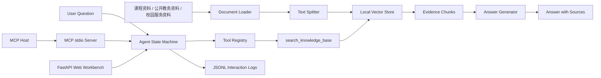
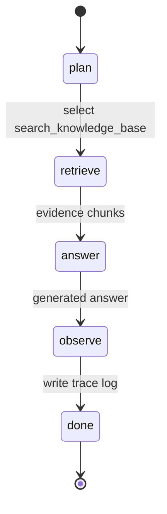

# Architecture Spec：EduRAG-Agent

## 1. 架构概览

## 2. Agent 状态机

## 3. 数据流

1. `app.cli ingest` 读取 `data/raw`。
2. Loader 将文件转为 `SourceDocument`。
3. Splitter 将长文档切为 `DocumentChunk`。
4. `LocalVectorStore` 计算词频向量并保存到 `data/processed/vectorstore.json`。
5. 用户通过 CLI 或 HTTP API 提问。
6. Agent 选择 `search_knowledge_base` 工具召回证据。
7. Generator 在本地抽取模式或 LLM 模式下生成答案。
8. Logger 写入 `logs/interactions.jsonl`。
9. MCP Host 可通过 `app/mcp_server.py` 调用同一个检索工具，复用 Agentic RAG 能力。

## 4. 模块职责

| 模块 | 职责 |
|---|---|
| `app/rag/loader.py` | 加载 Markdown、TXT、PDF |
| `app/rag/splitter.py` | 文本切分 |
| `app/rag/vectorstore.py` | 本地向量存储与相似度检索 |
| `app/agent/tools.py` | 工具注册与调用 |
| `app/agent/graph.py` | Agent 状态管理与多步骤执行 |
| `app/llm/provider.py` | 本地生成与 OpenAI 兼容生成 |
| `app/main.py` | Web 工作台、登录会话、知识库浏览和问答 API |
| `app/mcp_server.py` | MCP stdio 工具服务，暴露 `search_knowledge_base` |
| `app/eval/evaluator.py` | 行为评估与 Markdown 评估报告生成 |

## 5. 知识库资料组成

| 数据文件 | 内容 | 作用 |
|---|---|---|
| `data/raw/cs599_course_requirements.md` | CS599 项目方向、评分标准、提交要求和时间节点 | 回答课程项目与评分点问题 |
| `data/raw/real_public_grad_service_knowledge.md` | 公开研究生教务、学位论文、奖助、图书馆、信息化服务资料摘要 | 提升真实业务场景覆盖 |
| `data/raw/synthetic_campus_knowledge.md` | 合成校园服务 FAQ | 扩充演示规模和检索压力 |

## 6. 设计取舍

MVP 采用本地词频向量检索，优点是部署简单、无 API Key 也能完成演示。后续可以替换为 ChromaDB、FAISS 或 Milvus，并接入真实 embedding 模型。Agent 状态机采用轻量自研实现，接口上保持 LangGraph 风格，便于下一阶段迁移到 LangGraph。

MCP Server 采用 stdio JSON-RPC 方式实现，不引入额外依赖，降低演示环境复杂度。它复用现有 `build_agent()`，因此 CLI、Web API 和 MCP 调用共享同一个检索、生成和日志闭环。
