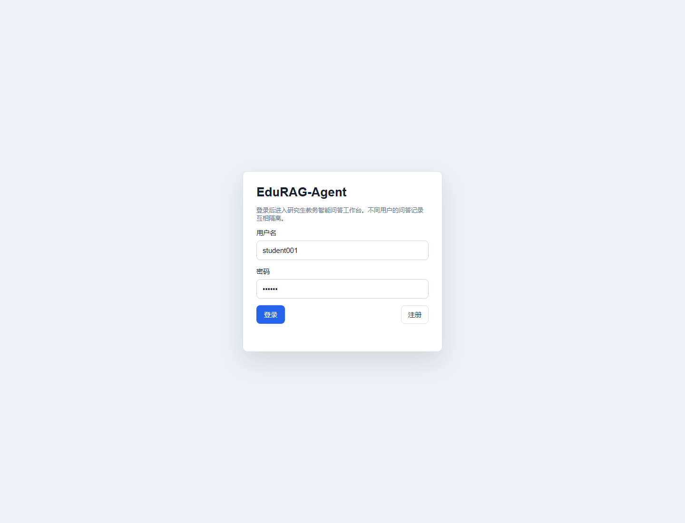

# 企业级应用软件设计与开发期末大作业报告

课程名称：企业级应用软件设计与开发
项目名称：EduRAG-Agent：面向研究生教务与课程资料的智能问答 Agent
方向：方向一：Agentic AI 原生开发
学号：2025302980
姓名：黎逆翔
专业：计算机技术
指导教师：戚欣
提交日期：2026 年 6 月 22 日

## 一、选题背景与设计思想

### 1.1 问题定义

研究生教务与课程项目资料通常分散在课程通知、培养方案、学位论文流程、奖助通知、图书馆指南、信息化服务说明和教师补充要求中。学生需要查询“期末大作业 PDF 是否要带目录导航”“Private 仓库需要添加谁为 Collaborator”“预答辩前要准备哪些材料”“校外访问电子资源能否共享 VPN 账号”等问题时，往往要跨多个页面和文档人工查找，且不同来源的权威性和适用范围并不一致。

本项目将这个问题抽象为面向研究生教务与课程资料的 Agentic RAG 问答系统：系统先把课程要求、公开教务资料和演示用校园服务知识整理为本地知识库，再由 Agent 根据用户问题完成规划、检索、回答、引用和记录。与普通“聊天机器人”不同，本项目强调证据约束、工具调用、状态管理、行为评估和可扩展工程结构。

### 1.2 现有方案不足

传统人工检索方式的主要问题是路径长、效率低、信息遗漏概率高。普通关键词搜索只能返回文档，不能直接形成带上下文的答案；通用大模型虽然能生成流畅文本，但容易出现来源缺失、事实混淆和“把不确定说成确定”的问题。对于课程大作业这种需要严格对齐评分项和提交规范的场景，答案不仅要“像是正确”，还必须能追溯到具体资料。

因此，本项目采用 Agentic RAG 技术路线：RAG 负责把答案约束在知识库证据内，Agent 负责把问题转化为工具调用与多步状态流转，API 与 Web 工作台负责承载真实用户交互，评估脚本负责验证行为质量。

### 1.3 项目价值

项目价值体现在三个层面。第一，面向用户，它能把分散资料转化为可追问、可引用、可复核的问答体验。第二，面向课程，它覆盖 SDD 规格驱动、Agent 工具调用、记忆机制、MCP 协议、测试评估和可观测性等课程重点。第三，面向工程实践，它不是孤立脚本，而是包含 CLI、FastAPI、Web 工作台、数据库、评估集、日志和 MCP Server 的完整应用雏形。

### 1.4 技术路线

技术路线分为四层：资料层、检索层、Agent 层和应用层。资料层负责导入 Markdown、TXT、PDF 等文件；检索层把资料切分为 chunk 并构建本地向量/词频索引；Agent 层以 `plan -> retrieve/act -> answer -> observe` 作为核心循环；应用层提供 CLI、HTTP API、Web 页面和 MCP stdio Server。系统默认使用本地抽取式生成，配置 DeepSeek/OpenAI 兼容接口后可切换为 LLM 生成。

```diagram architecture
```

## 二、Specs 规格文档

### 2.1 Product Spec

Product Spec 位于 `docs/product_spec.md`，定义了系统的产品定位、目标用户、典型问题、痛点、产品目标、非目标和成功指标。核心产品目标包括：

- 完成本地文档导入、切分、检索和问答闭环。
- 每次回答尽量附带来源 chunk，便于评阅和复核。
- 不在仓库中硬编码 API Key，支持环境变量配置。
- 区分课程要求、公开真实资料摘要和演示合成资料。
- 提供 Web 工作台，支持注册登录、多轮会话、知识库浏览和来源详情查看。
- 支持用户通过聊天触发受控数据库操作，例如创建、查询、完成和取消个人办事待办。
- 提供评估脚本，输出关键词命中率、来源命中率、缺失项和耗时。

这些目标已经映射到代码和数据结构中。例如 `data/raw/cs599_course_requirements.md` 对应课程项目要求，`data/raw/real_public_grad_service_knowledge.md` 对应公开教务资料摘要，`data/raw/synthetic_campus_knowledge.md` 对应演示知识库扩展内容。

### 2.2 Architecture Spec

Architecture Spec 位于 `docs/architecture_spec.md`，描述 Agentic RAG 的模块划分、状态机、数据流、模块职责和设计取舍。系统将复杂问题拆为可替换模块：Loader 负责文档读取，Splitter 负责文本切分，LocalVectorStore 负责本地检索，ToolRegistry 负责工具注册，EduRagAgent 负责状态流转，FastAPI 与 MCP Server 负责对外接口。

该规格的核心设计原则是“入口多样，核心复用”。CLI、Web API 和 MCP Server 都通过 `build_agent()` 组装同一个 Agent，因此不会出现多套问答逻辑不一致的问题。

### 2.3 API Spec

API Spec 位于 `docs/api_spec.md`，覆盖 Health、Auth、Ask、Conversation、Knowledge、Service Request 和 MCP Tool。关键接口如下：

| 类型 | 接口 / 工具 | 作用 |
|---|---|---|
| Health | `GET /health` | 检查服务状态 |
| Auth | `POST /api/register`、`POST /api/login` | 注册、登录并写入 HttpOnly Cookie |
| Ask | `POST /api/ask` | 基于会话上下文调用 Agent 问答 |
| Conversation | `GET /api/conversations` | 管理多轮会话 |
| Knowledge | `GET /api/knowledge`、`GET /api/knowledge/{chunk_id}` | 浏览知识库和来源详情 |
| Action | `GET/POST/PATCH /api/service-requests` | 创建、查询、更新个人办事记录 |
| MCP | `search_knowledge_base` | 向外部 MCP Host 暴露知识库检索能力 |

API 规格体现了 SDD 的可执行性：接口字段、错误策略、鉴权方式和工具 schema 都能在代码中找到对应实现。

```diagram spec
```

## 三、系统架构与设计

### 3.1 核心架构图

系统以 Agentic RAG 为中心，围绕资料导入、证据检索、工具调用、答案生成和行为记录形成闭环。

```diagram architecture
```

架构的关键点是把“问答生成”与“系统动作”统一纳入工具调用框架。知识类问题走 `search_knowledge_base`；个人办事类问题走 `create_service_request`、`list_service_requests` 或 `update_service_request`；所有路径最终都会进入 `observe` 阶段写入日志。

### 3.2 Agent 交互流程

Agent 核心循环位于 `app/agent/graph.py`。一次请求会经历以下状态：

```diagram agent
```

`plan` 阶段先判断用户问题是知识问答还是系统动作；`retrieve` 阶段调用知识库工具；`act` 阶段执行受控业务工具；`answer` 阶段把证据或工具结果格式化为用户答案；`observe` 阶段写入 JSONL 行为日志。这个流程使 Agent 的行为可以被调试、测试和审计。

### 3.3 数据流设计

```diagram dataflow
```

知识库构建从 `data/raw` 开始，文档被加载为 `SourceDocument`，再切分为 `DocumentChunk`，最终持久化到 `data/processed/vectorstore.json`。用户提问时，检索器返回带分数的 `RetrievalResult`，答案中展示 chunk 标题、来源路径、片段内容和引用编号。Web 端还可以通过知识库详情 API 查看完整来源。

### 3.4 聊天操作数据库流程

除了知识问答，系统还支持通过自然语言聊天操作数据库中的个人办事记录。用户可以输入“帮我创建一条待办：明天提交开题报告，紧急”“查看我的待办”“完成待办 1”等命令。Agent 在 `plan` 阶段先判断这是系统动作，而不是普通 RAG 问答；随后进入 `act` 阶段调用受控工具，由 `AppStore` 写入或查询 SQLite。

```diagram chatdb
```

该设计的关键不是让大模型直接生成 SQL，而是让大模型或规则只选择工具和结构化参数。真正的数据库写入由后端方法完成，并带有 `user_id` 校验、状态枚举校验和操作结果格式化，从而降低误操作和越权风险。

```diagram dbschema
```

### 3.5 模块职责

| 模块 | 文件 | 主要职责 |
|---|---|---|
| 文档加载 | `app/rag/loader.py` | 读取 Markdown、TXT、PDF 资料 |
| 文本切分 | `app/rag/splitter.py` | 按长度和标题切分知识片段 |
| 本地检索 | `app/rag/vectorstore.py` | 构建词频向量并执行相似度检索 |
| 工具注册 | `app/agent/tools.py` | 注册检索工具和办事工具 |
| Agent 状态机 | `app/agent/graph.py` | 规划、检索/行动、回答、记录 |
| LLM 适配 | `app/llm/provider.py` | 本地抽取式生成与 OpenAI 兼容生成 |
| Web 应用 | `app/main.py` | FastAPI、登录、会话、知识库和工作台页面 |
| MCP 服务 | `app/mcp_server.py` | 通过 stdio JSON-RPC 暴露检索工具 |
| 评估器 | `app/eval/evaluator.py` | 执行测试集并生成评估报告 |
| 数据库 | `app/core/db.py` | SQLite 用户、会话、办事记录和 Agent 动作日志 |

## 四、关键实现与代码展示

### 4.1 Agent 核心循环

Agent 的核心循环保持简洁，便于后续迁移到 LangGraph 或更复杂的多工具编排：

```python
state = self._plan(state)
if state.selected_tool == "search_knowledge_base":
    state = self._retrieve(state)
else:
    state = self._act(state)
state = self._answer(state)
self._observe(state)
state.step = "done"
```

这段逻辑体现了 Agentic AI 的核心思想：模型或规则不直接拼接最终结果，而是先做意图判断，再选择受控工具，最后基于工具返回生成答案。

```diagram implementation
```

### 4.2 工具定义

工具定义位于 `app/agent/tools.py`。系统当前注册四类工具：

| 工具 | 用途 | 权限边界 |
|---|---|---|
| `search_knowledge_base` | 检索课程、教务和校园服务资料 | 不需要登录，只读知识库 |
| `create_service_request` | 创建用户个人办事/待办记录 | 需要 `user_id` |
| `list_service_requests` | 查询当前用户办事记录 | 需要 `user_id` |
| `update_service_request` | 更新办事记录状态 | 需要 `user_id` 且只能操作本人记录 |

工具 schema 使用 JSON Schema 形式描述参数，便于 LLM Router、HTTP API 和 MCP Tool 复用。系统动作不是让 Agent 直接操作数据库，而是通过 `AppStore` 的受控方法执行，从而保证权限隔离和数据结构一致。

### 4.3 配置文件与安全处理

配置位于 `.env.example` 和 `app/core/config.py`。系统允许配置 `LLM_PROVIDER`、`LLM_API_KEY`、`LLM_BASE_URL`、`LLM_MODEL` 等环境变量。没有 API Key 时系统自动使用本地抽取式生成，不影响课程演示；有 API Key 时可切换到 DeepSeek/OpenAI 兼容接口。

安全处理包括：密码使用 PBKDF2 + salt 存储；登录态使用 HttpOnly Cookie；知识库与日志路径由配置集中管理；API Key 不写入代码仓库；个人办事记录按 `user_id` 隔离。

### 4.4 Web 工作台与 AI IDE 使用截图说明

Web 工作台由 `app/main.py` 提供，支持注册登录、多轮会话、知识库浏览、来源详情、系统统计和办事记录。由于报告生成环境无法自动截取交互窗口，本报告在 Demo 展示部分以可复现实验命令和页面功能截图位说明替代真实截图；实际答辩时可运行 `uvicorn app.main:app --reload --port 8000` 打开 `http://127.0.0.1:8000` 展示。

AI IDE 使用过程主要体现在三类产物中：第一，使用规格文档驱动实现，先写 Product/Architecture/API Spec 再落代码；第二，在 AI IDE 中围绕 Agent 核心循环、工具 schema、MCP Server 和评估脚本多轮迭代；第三，通过测试和评估报告反向修正检索字段、来源展示和系统动作边界。

### 4.5 聊天操作数据库实现

聊天操作数据库功能由 `app/agent/graph.py`、`app/agent/tools.py`、`app/core/db.py` 和 `app/main.py` 共同完成。用户在聊天框输入自然语言后，Agent 会优先让 DeepSeek/OpenAI-compatible Router 判断是否需要系统工具；如果外部 LLM 不可用，则退回本地规则解析。命中系统动作时，Agent 不进入知识库生成，而是调用工具并返回结构化执行结果。

```python
intent = self.generator.plan_system_action(state.question, history=state.history)
if intent:
    state.selected_tool = intent["tool"]
    state.tool_arguments = intent["arguments"]
    state.step = "act"
else:
    state.selected_tool = "search_knowledge_base"
```

数据库操作覆盖三类动作：

| 用户表达 | 工具 | 数据库行为 |
|---|---|---|
| `帮我创建一条待办：明天提交开题报告，紧急` | `create_service_request` | 向 `service_requests` 插入 `open` 状态记录 |
| `查看我的待办`、`查看全部办事记录` | `list_service_requests` | 按 `user_id` 和状态过滤查询 |
| `完成待办 1`、`取消工单 #2` | `update_service_request` | 更新本人记录的 `status` 字段 |

```diagram dbdemo
```

数据库表 `service_requests` 保存用户级办事记录，字段包括 `id`、`user_id`、`category`、`title`、`details`、`status`、`priority`、`due_date`、`created_at` 和 `updated_at`。`agent_action_logs` 用于记录工具名称、入参和返回结果，便于后续审计和可观测分析。Web 页面中的“我的办事待办”与聊天工具共用同一个 `AppStore`，因此无论从聊天创建还是从 HTTP API 创建，数据结构和权限边界都是一致的。

### 4.6 MCP 前沿技术融合

`app/mcp_server.py` 实现了 stdio JSON-RPC 风格的 MCP Server，暴露 `search_knowledge_base` 工具。外部 MCP Host 可以调用该工具，把本项目知识库能力作为上下文服务接入更大的 Agent 系统。该能力对应课程加分项中的 MCP 协议融合。

## 五、测试与评估

### 5.1 自动化测试

项目包含三组自动化测试：

| 测试文件 | 覆盖内容 |
|---|---|
| `tests/test_rag_pipeline.py` | 文档导入、切分、知识库构建、检索和问答闭环 |
| `tests/test_mcp_server.py` | MCP 工具列表和工具调用 |
| `tests/test_agent_actions.py` | Agent 创建、查询、完成个人办事记录，以及 LLM Router 优先级 |

测试覆盖了本项目最关键的风险点：检索是否能命中证据、MCP 工具是否可被外部调用、系统动作是否受权限和状态约束。

```diagram localtest
```

聊天操作数据库的自动化测试重点验证三点：第一，聊天语句能创建 `service_requests` 记录；第二，查询和完成待办会按当前用户隔离；第三，LLM Router 的结构化工具计划优先于本地关键词规则，确保接入 DeepSeek 后仍然走受控工具链。

```diagram dbtest
```

### 5.2 Agent 行为评估

评估集位于 `app/eval/test_cases.json`，共 25 条用例，覆盖 CS599 提交要求、报告章节、GitHub 仓库要求、核心技术点、MCP 加分项、PDF 导航要求，以及学籍、培养计划、课程考试、论文、奖助、VPN、图书馆、科研伦理和资料透明度等教务场景。

当前评估报告位于 `docs/evaluation_report.md`。汇总结果如下：

| 指标 | 结果 |
|---|---:|
| 测试用例数 | 25 |
| 平均关键词命中率 | 1.00 |
| 平均来源命中率 | 1.00 |
| 平均耗时 | 约 2 ms |
| 自动化测试 | 7 passed |

```diagram evaluation
```

评估方法不是只看回答是否“像正确”，而是同时检查关键词命中与来源命中。关键词命中用于判断答案是否覆盖核心事实，来源命中用于判断证据是否来自预期资料。评估报告还记录每个 case 的缺失关键词、缺失来源、耗时和首个来源，便于定位检索或回答问题。

### 5.3 Demo 展示

可复现 Demo 命令如下：

```powershell
python -m app.cli ingest --input data/raw
python -m app.cli ask "报告 PDF 必须包含哪些章节？"
python -m app.cli eval --dataset app/eval/test_cases.json --output docs/evaluation_report.md
pytest
uvicorn app.main:app --reload --port 8000
```



```diagram qademo
```

```diagram sourcedemo
```

```diagram dbinteraction
```

典型演示流程包括：注册登录；提问 CS599 报告要求并查看来源；追问“PDF 导航窗格有什么要求”；通过聊天创建“明天提交开题报告”的待办；在“我的办事待办”页面查看数据库记录；再用“完成待办 1”把状态更新为 done；进入知识库页面查看来源详情；启动 MCP Server 并调用 `search_knowledge_base`。

### 5.4 DeepSeek 联调测试

除了本地抽取式模式，项目也连接 DeepSeek 进行了真实 API 联调。当前 `.env` 中配置 `LLM_PROVIDER=deepseek`、`LLM_MODEL=deepseek-chat`，系统通过 OpenAI 兼容接口调用 DeepSeek；API Key 只从环境变量读取，不写入仓库和报告。

本次联调选取 4 条代表性问题，覆盖课程报告要求、加分项、校园 VPN 场景和聊天操作数据库。前三条问答用例返回 `openai-compatible` provider，说明实际答案由 DeepSeek 兼容接口生成；数据库动作返回 `system-tool` provider，说明 DeepSeek 参与工具路由，实际写库仍由受控后端工具执行。

| 问题 / 动作 | Provider | 耗时 | 命中率 / 结果 | 主要来源 / 数据库结果 |
|---|---|---:|---|---|
| 报告 PDF 必须包含哪些章节？ | openai-compatible | 11768 ms | 1.00 | `cs599_course_requirements / 报告要求` |
| 这个项目有哪些加分技术点？ | openai-compatible | 12028 ms | 1.00 | `cs599_course_requirements / 评分标准` |
| 校外访问电子资源可以共享 VPN 账号吗？ | openai-compatible | 11698 ms | 1.00 | `REAL-0039 图书馆服务`、`REAL-0036 校园 VPN` |
| 帮我创建一条待办：明天提交开题报告，紧急 | system-tool | 约 7800 ms | 创建成功 | 写入 `service_requests`：标题“提交开题报告”、分类“论文与学位”、优先级 high、状态 open |

```diagram deepseek
```

DeepSeek 数据库动作联调结果显示，模型将自然语言识别为 `create_service_request`，工具计划来源为 `llm-router`，后端成功写入临时 SQLite，并返回“已创建办事记录：#1 [open] 提交开题报告”。这说明系统不仅能用 DeepSeek 生成答案，也能让 DeepSeek 参与受控业务动作路由。

## 六、系统升级与扩展

### 6.1 可扩展架构

当前系统采用轻量本地实现，但模块边界为后续扩展预留了空间。检索层可以从本地词频向量替换为真实 embedding + ChromaDB/FAISS/Milvus；Agent 状态机可以迁移到 LangGraph；生成层可以从本地抽取式回答切换到 DeepSeek/OpenAI 兼容模型；日志层可以扩展为 Trace 可视化；MCP Server 可以增加更多工具，例如知识库增量更新、办事状态查询、课程日程提醒等。

### 6.2 下一阶段计划

下一阶段计划如下：

| 优先级 | 计划 | 预期收益 |
|---|---|---|
| P0 | 接入真实 embedding 模型和向量数据库 | 提升语义召回能力 |
| P0 | 增加 rerank 与“证据不足”判断 | 降低无关来源和幻觉风险 |
| P1 | 引入 LangGraph | 支持分支、重试、反思和多工具编排 |
| P1 | 增加 Trace 可视化页面 | 展示每步耗时、输入、输出、数据库动作和工具调用 |
| P1 | 云服务器部署 | 提供可访问 URL，支撑课堂展示 |
| P2 | 增加权限、审计和限流策略 | 接近生产级安全要求 |

### 6.3 AI 能力演进路径

AI 能力演进路径分为三步。第一步是检索增强：提高资料解析质量、chunk 结构和语义召回。第二步是工具增强：让 Agent 不只回答问题，还能执行受控业务操作。第三步是自治增强：引入任务规划、失败重试、证据自检、用户确认和可观测 Trace，使系统从课程 Demo 演进为更接近生产级的教务问答助手。

## 七、课程总结

通过本项目，我对企业级应用软件开发和 Agentic AI 的关系有了更具体的理解。企业级应用不是把模型接进接口就结束，而是要把需求、规格、架构、接口、数据、权限、测试、评估和运维串成闭环。Agentic AI 的难点也不只是 prompt，而是如何让模型在可控工具、明确状态和可验证证据中工作。

本项目带来的工程思维转变主要有三点。第一，从“先写代码”转向“先写规格”：Product Spec、Architecture Spec 和 API Spec 让实现目标更清晰。第二，从“看单次回答”转向“看行为评估”：关键词命中、来源命中和耗时比主观感受更稳定。第三，从“模型万能”转向“模型受控”：工具 schema、权限隔离、日志审计和证据引用共同决定系统是否可靠。

对课程的建议是：后续可以增加更多真实企业案例的 Agent 设计评审环节，例如让同学比较 RAG、Function Calling、MCP、Workflow 和 Multi-Agent 在同一业务中的取舍；也可以要求每个项目提供最小可复现评估集，这会促使大家从 Demo 思维转向工程交付思维。

总体来看，EduRAG-Agent 已经完成了从规格设计、核心实现到测试评估的闭环，并融合了 Agentic RAG、MCP、系统工具调用和可观测日志等技术点。后续如果接入真实 embedding、云部署和 Trace 可视化，系统可以进一步从课程作品演进为可试用的研究生教务问答助手。
